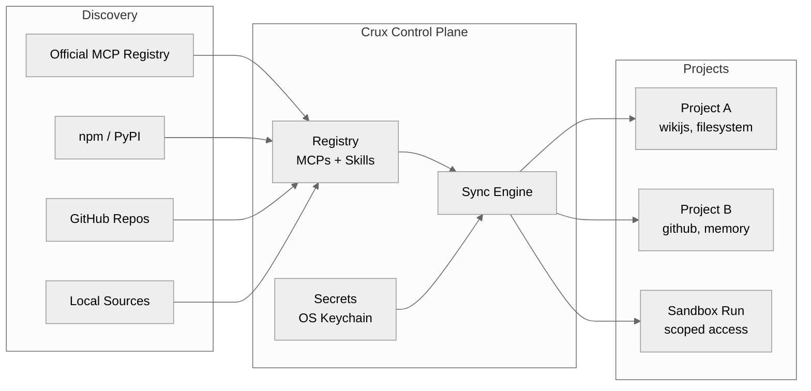

# Crux

**The package manager for AI agent tooling.**

[](https://github.com/crux-cli/crux/actions/workflows/ci.yml)
[](https://pypi.org/project/crux-cli/)
[](https://crux-cli.github.io/crux)
[](LICENSE)

---

### Your research agent just called the trading API.

You didn't mean for that to happen. But all 30 of your MCP servers are globally visible to every agent. The wiki bot has filesystem write access. The coding assistant sees your home automation MCPs. And the API key for your trading account? It's in a `.env` file committed to git three weeks ago.

**This is what MCP management looks like without a control plane.**

The ecosystem has 10,000+ MCP servers and 60,000+ skills — but no way to manage them. Every project gets the same 50 MCPs. Setting up a new project means copy-pasting `.mcp.json` by hand. Credentials leak. Agents hallucinate calls to services they shouldn't know exist.

## Set up a new project in 30 seconds

You're building a homelab assistant. It needs wiki access and filesystem tools — nothing else.

```bash
# Add tools to your personal registry (you do this once, ever)
crux add mcp filesystem --npx @modelcontextprotocol/server-filesystem
crux add mcp wikijs --github jaalbin24/wikijs-mcp-server
crux add skill autoresearch --github user/autoresearch-skill

# Store the wiki API key in your OS keychain — not in a file
crux secret set wikijs WIKIJS_API_KEY

# Create the project — it gets exactly what it needs
crux init homelab-assistant && cd homelab-assistant
crux install wikijs filesystem autoresearch
```

Done. Your project has a `crux.json` (committed to git) and a generated `.mcp.json` (gitignored). The wiki MCP launches via a script that fetches the API key from your keychain at runtime. No secret ever touches a file.

When a teammate clones the repo, they run `crux install` and get the same setup — with their own credentials from their own keychain.

## Run an agent with controlled access

Your research agent should access the wiki and a research skill. Not the filesystem. Not GitHub. Definitely not the trading API.

```bash
crux run "Find papers on MCP security and update the wiki" \
  --mcps wikijs \
  --skills autoresearch
```

Crux creates an isolated sandbox with only the declared tools. Before execution, it runs pre-flight checks — every MCP exists, every secret is stored, every source is built. If something's wrong, you get the exact command to fix it.

## A teammate joins your project

They clone the repo. They see `crux.json` listing what the project needs. They run:

```bash
crux install
crux secret set wikijs WIKIJS_API_KEY   # their own key
crux status                              # verify everything works
```

No Slack message asking "which MCPs does this project use?" No 30-minute setup. The manifest is the documentation.

## How it works



**Registry** — Add MCPs and skills once from npm, PyPI, GitHub, or local sources. One source of truth across all your projects.

**Secrets** — API keys live in your OS keychain (macOS Keychain, Linux Secret Service, or age-encrypted vault). Launcher scripts fetch them at runtime. Nothing is written to disk.

**Sync engine** — `crux sync` reads your project's `crux.json` and generates the `.mcp.json` that Claude Code expects, with only the tools you declared.

**Sandboxed execution** — `crux run` creates isolated environments where agents only see the MCPs you declare. Pre-flight validation catches misconfigurations before execution starts.

**Health monitoring** — `crux status` probes every MCP via JSON-RPC handshake. `crux doctor` validates your entire environment and auto-fixes what it can.

## Why scoping matters

**An agent with 5 relevant tools outperforms one drowning in 50.** Less noise in the context window means better outputs, fewer hallucinated tool calls, and tighter security. Scoping isn't just organization — it's a quality lever.

## Install

```bash
curl -LsSf https://raw.githubusercontent.com/crux-cli/crux/main/install.sh | sh
```

Or if you already have [uv](https://docs.astral.sh/uv/):

```bash
uv tool install crux-cli
crux setup
```

## Commands

```
Setup:
  crux setup                  Initialize ~/.crux and environment
  crux doctor                 Diagnose and auto-fix environment issues

Registry:
  crux add mcp <name>         Register an MCP (npm, PyPI, GitHub, local)
  crux add skill <name>       Register a skill
  crux remove <name>          Unregister an MCP or skill
  crux list                   List everything in the registry
  crux search <query>         Search the official MCP Registry
  crux upgrade [<name>]       Update cloned sources to latest

Project:
  crux init [<name>]          Create a project with crux.json
  crux install <name...>      Add MCPs/skills to project and sync
  crux uninstall <name...>    Remove MCPs/skills from project and sync
  crux sync [--all]           Generate .mcp.json from crux.json
  crux status [--all]         Show MCP server health

Secrets:
  crux secret set <mcp> <key> Store a secret in OS keystore
  crux secret get <mcp> <key> Retrieve a secret
  crux secret list [<mcp>]    List stored secrets (values masked)

Sandbox:
  crux run <task>             Execute agent with scoped MCP access
  crux run --file <manifest>  Execute from a reusable run manifest
  crux run list               List recent runs
  crux run clean              Remove completed sandboxes
```

## Security

Crux takes an opinionated stance: **there is no insecure-but-easier path.**

- Secrets never appear in any file on disk — only in your OS keystore
- Launcher scripts contain keystore lookup commands, not credential values
- Generated `.mcp.json` never contains secrets
- Each sandbox gets only the MCPs explicitly declared for that run
- Path traversal protections on all file operations

## Documentation

Full docs, guides, and API reference at [crux-cli.github.io/crux](https://crux-cli.github.io/crux).

## Development

```bash
git clone https://github.com/crux-cli/crux
cd crux
uv sync --extra dev
uv run pytest tests/ -v
```

## License

[MIT](LICENSE)
