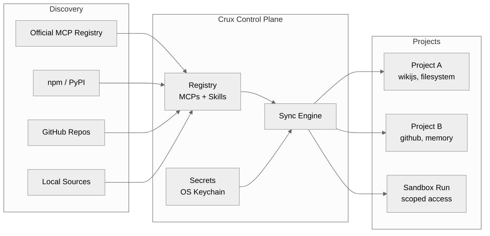

# Crux

**Manage your MCP servers and skills like packages.**

[](https://github.com/crux-cli/crux/actions/workflows/ci.yml)
[](https://pypi.org/project/crux-cli/)
[](https://crux-cli.github.io/crux)
[](LICENSE)

---

Crux is a CLI tool that brings package-management to your [Claude Code](https://docs.anthropic.com/en/docs/claude-code) workflows. You add MCP servers and skills to a local registry, declare which ones each project needs, and Crux generates the config — with credentials stored in your OS keychain, not in files.

It runs on your machine (macOS or Linux), works with Claude Code, and installs in one command.

## Install

```bash
curl -LsSf https://raw.githubusercontent.com/crux-cli/crux/main/install.sh | sh
```

Or if you already have [uv](https://docs.astral.sh/uv/): `uv tool install crux-cli && crux setup`

## Stop editing `.mcp.json` by hand

Build a personal registry of MCP servers and skills. Each project declares what it needs. Crux generates the rest.

```bash
# Add tools to your registry once — use them in any project
crux add mcp filesystem --npx @modelcontextprotocol/server-filesystem
crux add mcp github --npx @modelcontextprotocol/server-github
crux add mcp wikijs --github jaalbin24/wikijs-mcp-server
crux add skill autoresearch --github user/autoresearch-skill

# Search the official MCP registry to discover new tools
crux search "database"
```

## Keep API keys out of your config files

Crux stores every credential in your **OS keychain** — macOS Keychain, Linux Secret Service, or an age-encrypted vault. Launcher scripts fetch secrets at runtime. Nothing is ever written to a config file.

```bash
crux secret set wikijs WIKIJS_API_KEY
crux secret set github GITHUB_TOKEN
```

## Give each project exactly the tools it needs

An agent with 5 relevant tools outperforms one with 50 irrelevant ones. Crux lets each project declare its own subset:

```bash
crux init homelab-assistant && cd homelab-assistant
crux install wikijs filesystem autoresearch
crux status
```

This creates a `crux.json` — your project's tool manifest. Commit it to git. The generated `.mcp.json` is gitignored and rebuilt by `crux sync`.

## Run agents with controlled tool access

```bash
crux run "Summarize MCP security research and update the wiki" \
  --mcps wikijs \
  --skills autoresearch
```

Crux creates a sandbox with only the declared tools. Pre-flight checks verify everything is ready before execution starts.

## Know when something is broken

```bash
crux status   # probe every MCP via JSON-RPC handshake
crux doctor   # full environment check with auto-fix
```

## Architecture



## Commands

```
Setup:
  crux setup                  Initialize ~/.crux and environment
  crux doctor                 Diagnose and auto-fix environment issues

Registry:
  crux add mcp <name>         Register an MCP (npm, PyPI, GitHub, local)
  crux add skill <name>       Register a skill
  crux remove <name>          Unregister an MCP or skill
  crux list                   List everything in the registry
  crux search <query>         Search the official MCP Registry
  crux upgrade [<name>]       Update cloned sources to latest

Project:
  crux init [<name>]          Create a project with crux.json
  crux install <name...>      Add MCPs/skills to project and sync
  crux uninstall <name...>    Remove MCPs/skills from project and sync
  crux sync [--all]           Generate .mcp.json from crux.json
  crux status [--all]         Show MCP server health

Secrets:
  crux secret set <mcp> <key> Store a secret in OS keystore
  crux secret get <mcp> <key> Retrieve a secret
  crux secret list [<mcp>]    List stored secrets (values masked)

Sandbox:
  crux run <task>             Execute agent with scoped MCP access
  crux run --file <manifest>  Execute from a reusable run manifest
  crux run list               List recent runs
  crux run clean              Remove completed sandboxes
```

## Security

Crux takes an opinionated stance: **there is no insecure-but-easier path.**

- Secrets never appear in any file on disk — only in your OS keystore
- Launcher scripts contain keystore lookup commands, not credential values
- Generated `.mcp.json` never contains secrets
- Each sandbox gets only the MCPs explicitly declared for that run
- Path traversal protections on all file operations

## Documentation

Full docs, guides, and API reference at [crux-cli.github.io/crux](https://crux-cli.github.io/crux).

## Development

```bash
git clone https://github.com/crux-cli/crux
cd crux
uv sync --extra dev
uv run pytest tests/ -v
```

## License

[MIT](LICENSE)
