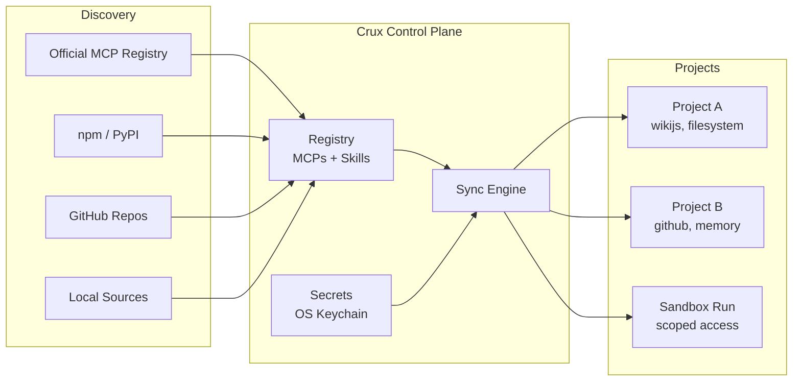

# Crux

**The package manager for AI agent tooling.**

[](https://github.com/crux-cli/crux/actions/workflows/ci.yml)
[](https://pypi.org/project/crux-cli/)
[](https://crux-cli.github.io/crux)
[](LICENSE)

---

Your agents use dozens of MCP servers and skills. Crux manages them the way `npm` manages packages — one manifest, scoped per project, credentials never in files.

## The problem

You have 30 MCP servers across 8 projects. Each project needs a different subset. Your research agent accidentally called the trading API because all MCPs were globally visible. API keys sit in `.env` files committed to git. Setting up a new project means 30 minutes of config editing instead of 30 seconds.

| Pain | What happens |
|------|-------------|
| **Configuration sprawl** | 20 projects x 50 MCPs = 20 hand-maintained `.mcp.json` files |
| **Credential leakage** | 48% of MCP servers recommend storing API keys in plaintext |
| **No scoping** | Every agent sees every tool — more noise, worse outputs, security risk |
| **No reproducibility** | No `npm install` equivalent for AI tooling |
| **Skills are unmanaged** | 60,000+ skills as files you manually copy between machines |

## The solution

```bash
# Build your personal tool registry (once, ever)
crux add mcp filesystem --npx @modelcontextprotocol/server-filesystem
crux add mcp wikijs --github jaalbin24/wikijs-mcp-server
crux add skill autoresearch --github user/autoresearch-skill

# Credentials go in your OS keychain — never in files
crux secret set wikijs WIKIJS_API_KEY

# Each project declares exactly what it needs
crux init homelab-assistant && cd homelab-assistant
crux install wikijs filesystem autoresearch
crux status
```

Your project now has a `crux.json` (committed to git) and a generated `.mcp.json` (gitignored). When a teammate clones the repo, they run `crux install` and get the same setup — with their own credentials from their own keychain.

## Architecture



**Registry** — Add MCPs and skills once from npm, PyPI, GitHub, or local sources. One source of truth across all projects.

**Project scoping** — Each project declares exactly which MCPs and skills it needs in `crux.json`. `crux sync` generates the `.mcp.json` Claude Code expects. No ambient access.

**Secrets** — Credentials live in your OS keystore (macOS Keychain, Linux Secret Service, or age-encrypted vault). Generated launcher scripts fetch them at runtime. Nothing is ever written to disk.

**Sandboxed execution** — `crux run` creates isolated environments where agents only see the MCPs you declare. Pre-flight validation catches misconfigurations before execution starts.

**Health monitoring** — `crux status` probes every MCP via JSON-RPC handshake. `crux doctor` validates your entire environment and auto-fixes what it can.

## Why scoping matters

**An agent with 5 relevant tools outperforms one drowning in 50 irrelevant ones.** Less noise in the context window means better outputs, fewer hallucinated tool calls, and tighter security. Scoping isn't just organization — it's a quality lever.

## Install

```bash
curl -LsSf https://raw.githubusercontent.com/crux-cli/crux/main/install.sh | sh
```

The installer checks for [uv](https://docs.astral.sh/uv/), installs it if missing, pulls `crux-cli` from PyPI, initialises `~/.crux/`, and tells you exactly what to do next.

**Alternatively**, if you already have uv:

```bash
uv tool install crux-cli
crux setup
```

## Run an agent in a sandbox

Your research agent should only access the wiki and a research skill — no filesystem, no GitHub, no trading APIs.

```bash
crux run "Find papers on MCP security and update the wiki" \
  --mcps wikijs \
  --skills autoresearch
```

Before execution, Crux runs pre-flight checks — every MCP exists, every secret is stored, every source is built. If something's missing, you get the exact command to fix it.

## Commands

```
Setup:
  crux setup                  Initialize ~/.crux and environment
  crux doctor                 Diagnose and auto-fix environment issues

Registry:
  crux add mcp <name>         Register an MCP (npm, PyPI, GitHub, local)
  crux add skill <name>       Register a skill
  crux remove <name>          Unregister an MCP or skill
  crux list                   List everything in the registry
  crux search <query>         Search the official MCP Registry
  crux upgrade [<name>]       Update cloned sources to latest

Project:
  crux init [<name>]          Create a project with crux.json
  crux install <name...>      Add MCPs/skills to project and sync
  crux uninstall <name...>    Remove MCPs/skills from project and sync
  crux sync [--all]           Generate .mcp.json from crux.json
  crux status [--all]         Show MCP server health

Secrets:
  crux secret set <mcp> <key> Store a secret in OS keystore
  crux secret get <mcp> <key> Retrieve a secret
  crux secret list [<mcp>]    List stored secrets (values masked)

Sandbox:
  crux run <task>             Execute agent with scoped MCP access
  crux run --file <manifest>  Execute from a reusable run manifest
  crux run list               List recent runs
  crux run clean              Remove completed sandboxes
```

## Security

Crux takes an opinionated stance: **there is no insecure-but-easier path.**

- Secrets never appear in any file on disk — only in your OS keystore
- Launcher scripts contain keystore lookup commands, not credential values
- Generated `.mcp.json` never contains secrets
- Each sandbox gets only the MCPs explicitly declared for that run
- Path traversal protections on all file operations

## Why not just...

| Alternative | What's missing |
|------------|---------------|
| Edit `.mcp.json` by hand | No scoping, no secrets management, config drift, no reproducibility |
| Smithery / PulseMCP | Discovery platforms — they help you *find* MCPs, not *manage* them |
| Docker MCP Gateway | Container isolation only — no registry, no scoping, no credentials |
| MCPM | Profile-based — no project manifests, no keystore secrets, no sandbox |

Crux is the full lifecycle: **curate → scope → secure → execute → monitor.**

## Documentation

Full docs, guides, and API reference at [crux-cli.github.io/crux](https://crux-cli.github.io/crux).

## Development

```bash
git clone https://github.com/crux-cli/crux
cd crux
uv sync --extra dev
uv run pytest tests/ -v
uv run ruff check src/crux_cli/ tests/
```

## License

[MIT](LICENSE)
