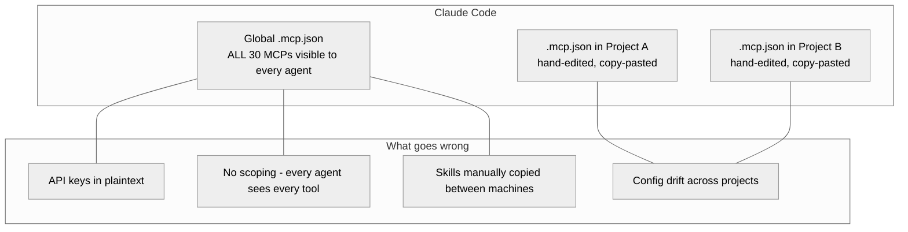
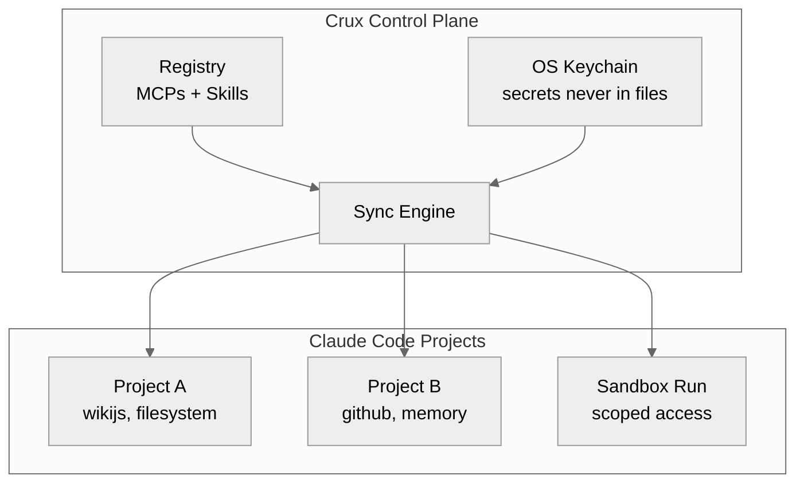

# Crux

**Manage your MCP servers and skills like packages.**

[](https://github.com/crux-cli/crux/actions/workflows/ci.yml)
[](https://pypi.org/project/crux-cli/)
[](https://crux-cli.github.io/crux)
[](LICENSE)

---

Crux is a CLI tool for **macOS** and **Linux** that brings package-management to your **[Claude Code](https://docs.anthropic.com/en/docs/claude-code)** agentic workflows. Add MCP servers and skills to a local registry, declare which ones each project needs, and let Crux generate the config — with credentials in your OS keychain, never in files.

## Are you taking full advantage of Claude Code?

The MCP ecosystem has 10,000+ servers and 60,000+ skills that can supercharge your agentic workflows. But managing them across projects is a chore — copy-pasting `.mcp.json`, manually dropping skill files into directories, no single place to manage it all.

**Crux gives you a personal registry.** Add once, use in any project.

```bash
crux add mcp filesystem --npx @modelcontextprotocol/server-filesystem
crux add mcp github --npx @modelcontextprotocol/server-github
crux add mcp wikijs --github jaalbin24/wikijs-mcp-server
crux add skill autoresearch --github user/autoresearch-skill
crux search "database"   # discover more from the official registry
```

## Overwhelmed managing MCPs, skills, and projects?

20 projects, each needing a different combination of tools, each with a hand-edited `.mcp.json`. Add a new MCP and you're updating every project that needs it.

**Crux scopes tools per project.** Declare what each project needs. Crux generates the rest.

```bash
crux init homelab-assistant && cd homelab-assistant
crux install wikijs filesystem autoresearch
crux status
```

Your `crux.json` — committed to git — is clean and declarative:

```json
{
  "name": "homelab-assistant",
  "mcps": ["wikijs", "filesystem"],
  "skills": ["autoresearch"]
}
```

## Afraid of the risk agentic AI poses if misconfigured?

When every agent sees every tool, one misconfiguration can have outsized consequences. API keys in plaintext get committed to git. A research task accidentally writes to production.

**Crux isolates and secures.** Credentials in your OS keychain. Sandboxed runs with only the tools you declare. Pre-flight checks before execution.

```bash
crux secret set wikijs WIKIJS_API_KEY
crux run "Summarize MCP security research and update the wiki" \
  --mcps wikijs --skills autoresearch
crux doctor   # full environment health check
```

## Before and after

### Without Crux



### With Crux



Each project sees **only** its declared tools. Secrets fetched from the keychain at runtime. No config drift. No ambient access.

## Install

```bash
curl -LsSf https://raw.githubusercontent.com/crux-cli/crux/main/install.sh | sh
```

Or if you already have [uv](https://docs.astral.sh/uv/): `uv tool install crux-cli && crux setup`

## Commands

```
Setup:
  crux setup                  Initialize ~/.crux and environment
  crux doctor                 Diagnose and auto-fix environment issues

Registry:
  crux add mcp <name>         Register an MCP (npm, PyPI, GitHub, local)
  crux add skill <name>       Register a skill
  crux remove <name>          Unregister an MCP or skill
  crux list                   List everything in the registry
  crux search <query>         Search the official MCP Registry
  crux upgrade [<name>]       Update cloned sources to latest

Project:
  crux init [<name>]          Create a project with crux.json
  crux install <name...>      Add MCPs/skills to project and sync
  crux uninstall <name...>    Remove MCPs/skills from project and sync
  crux sync [--all]           Generate .mcp.json from crux.json
  crux status [--all]         Show MCP server health

Secrets:
  crux secret set <mcp> <key> Store a secret in OS keystore
  crux secret get <mcp> <key> Retrieve a secret
  crux secret list [<mcp>]    List stored secrets (values masked)

Sandbox:
  crux run <task>             Execute agent with scoped MCP access
  crux run --file <manifest>  Execute from a reusable run manifest
  crux run list               List recent runs
  crux run clean              Remove completed sandboxes
```

## Security

Crux takes an opinionated stance: **there is no insecure-but-easier path.**

- Secrets never appear in any file on disk — only in your OS keystore
- Launcher scripts contain keystore lookup commands, not credential values
- Generated `.mcp.json` never contains secrets
- Each sandbox gets only the MCPs explicitly declared for that run
- Path traversal protections on all file operations

## Documentation

Full docs, guides, and API reference at [crux-cli.github.io/crux](https://crux-cli.github.io/crux).

## Development

```bash
git clone https://github.com/crux-cli/crux
cd crux
uv sync --extra dev
uv run pytest tests/ -v
```

## License

[MIT](LICENSE)
